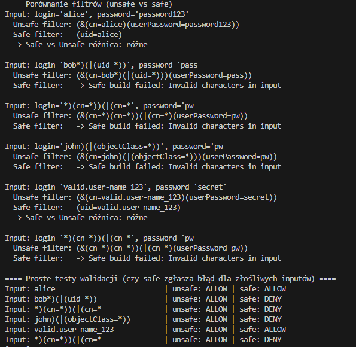

# Raport z Analizy Podatności LDAP Injection

## 1. Wprowadzenie: Czym jest LDAP Injection?

>**LDAP Injection** jest typem ataku polegającym na wstrzyknięciu złośliwych danych do filtra (zapytania) Lightweight Directory Access Protocol (**LDAP**). Serwery LDAP są często używane do przechowywania informacji o użytkownikach, uwierzytelniania oraz zarządzania uprawnieniami.

Gdy aplikacja buduje filtr LDAP poprzez **bezpośrednie połączenie (konkatenację)** danych wprowadzonych przez użytkownika bez odpowiedniego ich sprawdzenia (**walidacji**) lub zabezpieczenia (**escapowania**), atakujący może wprowadzić specjalne znaki sterujące (`*`, `(`, `)`, `&`, `|`, `=`, `>`, `<`), które zmienią logikę filtra.

## 2. Implementacja wersji secure i vulnerable

Scenariusz testów polega na utworzeniu prostej metody do uwierzytelniania. Interfejs `LDAPClient` udostępnia metodę, która przyjmuje dwa parametry, traktujemy je jako login i hasło użytkownika, który chce uzyskać dostęp do usługi udostępnianej poprzez LDAP.
```java
boolean authenticate(String userInput, String password) throws Exception;
```

Klasa `vulnerable_ldap_injection_papuga` jest przykładem użycia błędnych praktyk, umożliwiających łatwe manipulowanie filtrem wyszukiwania, zakłądając, że zapytanie wysyłane do serwera wykorzystuje poniższy filtr (dla uproszczenia w kodzie bez hash'a MD5):
```
(&(cn=[login])(userPassword=MD5[haslo]))
```
Przykład filtra ze strony:
[https://sekurak.pl/podatnosc-ldap-injection-definicje-przyklady-ataku-metody-ochrony/](https://sekurak.pl/podatnosc-ldap-injection-definicje-przyklady-ataku-metody-ochrony/)

Metoda implementująca uwierzytelnianie buduje filtr poprzez prostą konkatencję:
```java
@Override
public String buildFilterForUser(String userInput, String password) {
    return "(&(cn=" + userInput + ")(userPassword=" + password + "))";
}
```

Następnie tworzy połączenie do serwera LDAP (nie wykorzystując puli, ani żadnych ograniczeń w połączeniu) i ustawia zapytanie `searchQuery` korzystając z zbudowanego wczesniej filtra. Następnie zwraca wynik wyszukiwania, tylko jeśli będzie on różny od `null`. Dodatkowo zwraca komunikaty o błędach, co umożliwia łatwiejsze "debugowanie" jak modyfikować treścią filtru aby poprawnie wykorzystać podatność `ldap injection`. 
```java
        String filter = buildFilterForUser(userInput, password);
        LDAPConnection connection = null;
        try {
            connection = new LDAPConnection(ldapHost, ldapPort, serviceBindDN, servicePassword);

            SearchRequest searchRequest = new SearchRequest(
                    baseDN,               
                    SearchScope.SUB,      
                    filter);

            SearchResult searchResult = connection.search(searchRequest);

            return !searchResult.getSearchEntries().isEmpty();

        } catch (LDAPException e) {
            System.err.println("LDAP error: " + e.getMessage());
            System.err.println("Used filter: " + filter);
            throw new Exception("LDAP error: " + e.getMessage() + " | Used filter: " + filter, e);
        } finally {
            if (connection != null)
                connection.close();
        }
```
Błędy tej wersji:
 * bezpośrednia konkatenacja danych wejściowych do filtra LDAP
 * brak walidacji/escapowania
 * brak TLS / brak timeoutów
 * logowanie wrażliwych danych (np. zwracanie szczegółów błędu i filtra użytkownikowi)


Wersja bezpieczna - klasa `fixed_ldap_injection_papuga` zmienia logikę samego uwierzytelniania tj. najpierw znajduje unikalnego użytkownika, a potem wywołuje operację `bind`, która sprawdza poprawność podanego hasła.

Metoda budowy filtra opiera się na `normalizacji`, `walidacji` oraz wykorzystania funkcji tworzącej filtr przy wykorzystaniu klasy Filter biblioteki `com.unboundid.ldap.sdk` (nie jest to bezpieczne bez korzystania z normalizacji i walidacji - jedynie zapewnia brak pomyłki w tworzeniu filtra przy użyciu notacji polskiej wykorzystywanej w LDAP)

```java
@Override
public String buildFilterForUser(String userInput) throws Exception {
    String normalized = normalizeAndValidateUserInput(userInput);
    Filter f = Filter.createEqualityFilter("uid", normalized);
    return f.toString();
}
```

Normalizacja sprowadza się do kilku etapów:
- nie dopuszczamy pustych wartości
- normalizacja NFC (działa poprzez kanoniczne normalizowanie ciągów znaków Unicode. Oznacza to, że konwertuje on znak do jego jedynej, kanonicznej formy, rozkładając znaki lub łącząc je w określonej kolejności, aby zapewnić spójność, nawet jeśli znaki te mogły zostać utworzone w różny sposób)
- ustawienie maksymalnej długości inputu
- dopuszczenie tylko znaków `alfanumerycznych` oraz `.`,`_`,`-`
```java
private static final Pattern UID_ALLOWLIST = Pattern.compile("^[\\p{Alnum}._-]{1,64}$");

private String normalizeAndValidateUserInput(String input) {
    if (input == null) {
        throw new IllegalArgumentException("Empty input");
    }

    String normalized = Normalizer.normalize(input, Normalizer.Form.NFC).trim();

    if (normalized.length() == 0 || normalized.length() > 64) {
        throw new IllegalArgumentException("Invalid input length");
    }

    if (!UID_ALLOWLIST.matcher(normalized).matches()) {
        throw new IllegalArgumentException("Invalid characters in input");
    }

    return normalized;
}
```

Sama metoda uwierzytalniania korzysta z następujących zabezpieczeń:
- określenie timeoutu połączenia z usługą
    ```java
    LDAPConnectionOptions opts = new LDAPConnectionOptions();
    opts.setConnectTimeoutMillis(connectTimeoutMillis);
    ```
- budowa zapytania z ograniczeniem danych wynikowych do 1 rekordu i timeout 5 sekund odpowiedzi zapytania
    ```java
    SearchRequest req = new SearchRequest(baseDN, SearchScope.SUB, searchFilter);
    req.setSizeLimit(1);
    req.setTimeLimitSeconds(5);
    ```
- brak logowania danych o błędach widocznych dla użytkownika (jedynie można logować takie dane, nie udostępniając ich, aby zbierać informacje o działaniu systemu oraz umożliwić monitorowanie prób włamań)
    ```java
    if (sr.getEntryCount() != 1) {
            return false;
    }
    ```
- pobranie ze zwróconego wyniku tylko rekordu `Distinguished Name`, który jednoznacznie identyfikuje obiekt w ldap, zamiast używania `CN`, czyli części rekordu `DN` zawierającego nazwę obiektu (np. login użytkownika) i zweryfikowanie dopiero na tym etapie poprawności hasła.
    ```java
    String userDN = sr.getSearchEntries().get(0).getDN();

    LDAPConnection userConn = null;
    try {
        userConn = new LDAPConnection(opts, ldapHost, ldapPort);
        BindResult bindResult = userConn.bind(userDN, password);
        return bindResult.getResultCode() == ResultCode.SUCCESS;
        } finally {
            if (userConn != null) userConn.close();
    }
    ```

***NOTE: Wersja bezpieczna pomija wykorzystanie bezpiecznego połącznie SSL oraz puli połączeń, które w wersji produkcyjniej byłyby konieczne...***

## 3. Main
Plik main porównuje w prosty sposób, jak wygląda budowa filtra dla wersji bezpiecznej i niebezpiecznej, oraz pokazuje, czy wersja bezpieczna umożliwia zbudowanie takiego filtra.
