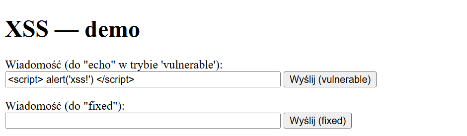
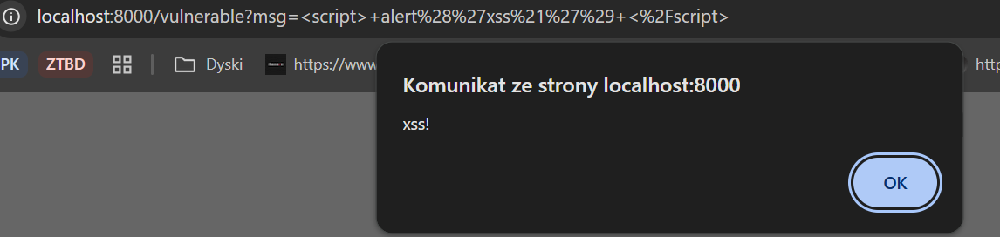
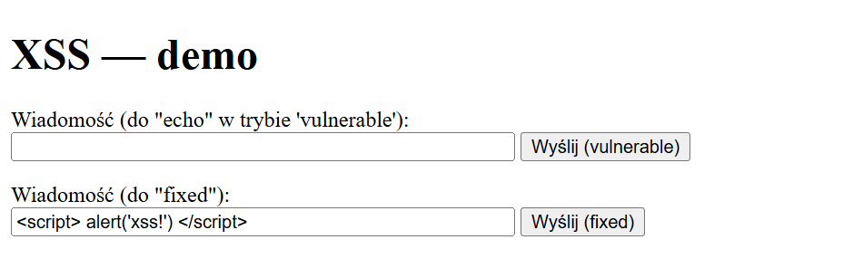
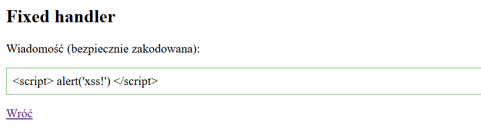

# Raport z Analizy Podatności XSS

## 1. Wprowadzenie: Czym jest XSS (cross-site-scripting)?

> **cross-site-scripting** polega na wstrzyknięciu do przeglądarki ofiary fragmentu javascript bądź innego języka skryptowego (np. VBScript), który może być uruchomiony w przeglądarce

Definicja ze strony [https://sekurak.pl/czym-jest-xss/](https://sekurak.pl/czym-jest-xss/)

## 2. Implementacja wersji secure i vulnerable

### Wersja podatna (`vulnerable_xss_papuga.java`)

Wersja podatna pobiera parametr `msg` z zapytania (dane wejściowe formularza) i **wstawia go bezpośrednio do odpowiedzi HTML** bez żadnego filtrowania czy kodowania. Przykładowy fragment kodu:

```java
String body = "<div>" + msg + "</div>";
```

### Wersja bezpieczna (`fixed_xss_papuga.java`)

Wersja bezpieczna również pobiera parametr `msg`, ale **przed wstawieniem do odpowiedzi HTML koduje go przy użyciu biblioteki OWASP Java Encoder**:

```java
String safe = Encode.forHtml(msg);
String body = "<div>" + safe + "</div>";
```

Zastosowanie `Encode.forHtml(msg)` powoduje, że wszystkie znaki specjalne HTML (np. `<`, `>`, `"`, `'`) zostają zamienione na bezpieczne encje, uniemożliwiając wykonanie wstrzykniętego kodu.

## 3. Działanie przykładu
Aplikacja uruchamia prosty serwer HTTP z dwoma endpointami:

- `/vulnerable` – wersja podatna na XSS
- `/fixed` – wersja bezpieczna

Formularz testowy w pliku `index.html` pozwala przesłać dowolny tekst do obu wersji. Wersja podatna wyświetli przesłany kod bezpośrednio, umożliwiając wykonanie JavaScript, natomiast wersja bezpieczna wyświetli zakodowany tekst, uniemożliwiając atak XSS.

Wysłanie skryptu w wersji niebezpiecznej poprzez pole formularza:



Wysłanie skryptu w wersji bezpiecznej poprzez pole formularza:

